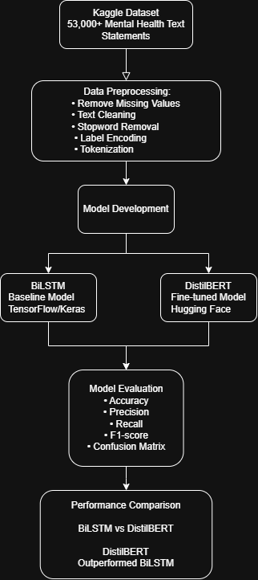
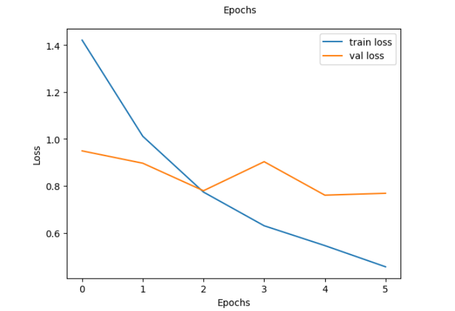
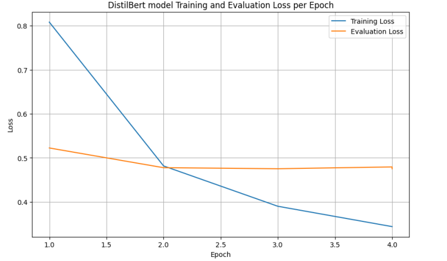
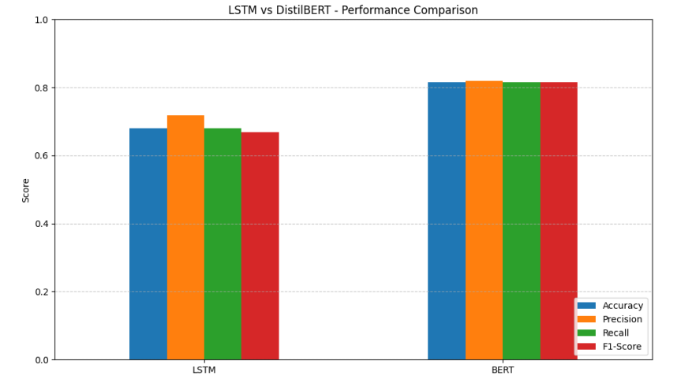

# 🧠 Mental Health Text Classification using BiLSTM and DistilBERT

An end-to-end **Natural Language Processing (NLP)** project comparing a **Bidirectional Long Short-Term Memory (BiLSTM)** network with a fine-tuned **DistilBERT** transformer for multi-class mental health text classification.

Developed as part of the **Applied Artificial Intelligence Postgraduate Program** at **George Brown College**, this project demonstrates a complete machine learning workflow—from exploratory data analysis and text preprocessing to deep learning model development and performance evaluation.

---

# ⭐ Project Highlights

* Developed and evaluated two deep learning models for multi-class mental health text classification.
* Compared a traditional **BiLSTM** baseline with a fine-tuned **DistilBERT** transformer.
* Processed and classified over **53,000** labelled mental health text statements.
* Achieved **82% test accuracy** and **0.82 weighted F1-score** using DistilBERT.
* Built using **Python, TensorFlow, Hugging Face Transformers, Scikit-learn, Pandas, and NumPy**.
* Organized as a reproducible machine learning project with modular notebooks and documentation.

---

# 📌 Project Overview

Mental health support platforms generate large volumes of unstructured text from online discussions, surveys, and social platforms. Manual analysis is difficult to scale and often requires significant human effort.

This project investigates two deep learning approaches for automatically classifying mental health-related text into seven categories:

* **Bidirectional LSTM (BiLSTM)** – a recurrent neural network baseline for sequential text modelling.
* **DistilBERT** – a lightweight transformer model fine-tuned using transfer learning.

Both models were trained and evaluated using the same dataset and evaluation metrics to demonstrate the advantages of transformer-based language models for contextual text understanding.

---

# 📂 Dataset

**Source**

Kaggle — *Sentiment Analysis for Mental Health*

https://www.kaggle.com/datasets/suchintikasarkar/sentiment-analysis-for-mental-health

### Dataset Summary

* 53,000+ labelled English text statements
* Seven mental health categories
* Multi-class text classification problem

Categories:

* Anxiety
* Bipolar
* Depression
* Normal
* Personality Disorder
* Stress
* Suicidal

> **Note:** The dataset is **not included** in this repository. Please download it from Kaggle and place `raw_data.csv` inside `data/raw/`.

---

# 🔄 Project Workflow

<p align="center">

</p>

---

# 📁 Repository Structure

```text
mental-health-text-classification/
│
├── data/
│   ├── raw/
│   ├── dataset_description.md
│   └── data_preprocessing.md
│
├── images/
│   ├── project_workflow.png
│   ├── dataset_distribution.png
│   ├── bilstm_training_accuracy_loss.png
│   ├── bilstm_confusion_matrix.png
│   ├── distilbert_training_loss.png
│   ├── distilbert_confusion_matrix.png
│   └── model_comparison.png
│
├── models/
│   └── README.md
│
├── notebooks/
│   ├── 01_eda_preprocessing.ipynb
│   ├── 02_bilstm_training.ipynb
│   ├── 03_distilbert_training.ipynb
│   └── 04_model_evaluation.ipynb
│
├── requirements.txt
├── LICENSE
├── .gitignore
└── README.md
```

---

# 🛠 Technologies Used

| Category             | Technologies                                        |
| -------------------- | --------------------------------------------------- |
| Programming Language | Python                                              |
| Deep Learning        | TensorFlow, Keras, PyTorch                          |
| NLP                  | Hugging Face Transformers, DistilBERT, BiLSTM, NLTK |
| Data Processing      | Pandas, NumPy                                       |
| Machine Learning     | Scikit-learn                                        |
| Visualization        | Matplotlib, Seaborn                                 |
| Development          | Jupyter Notebook, Google Colab                      |
| Version Control      | Git, GitHub                                         |

---

# 🧹 Methodology

## 1. Exploratory Data Analysis

* Examined class distribution
* Checked missing values
* Explored text length distribution
* Investigated dataset imbalance

---

## 2. Data Preparation & Feature Engineering

* Removed missing values
* Converted text to lowercase
* Removed English stopwords
* Encoded labels using `LabelEncoder`
* Tokenized text using:

  * Keras Tokenizer (BiLSTM)
  * Hugging Face AutoTokenizer (DistilBERT)
* Split the dataset into training, validation, and testing sets

---

## 3. Bidirectional LSTM

A Bidirectional LSTM model was implemented as the baseline architecture.

Architecture:

* Embedding Layer
* Bidirectional LSTM
* Dropout
* Batch Normalization
* Dense Layer
* Softmax Output

### Training Curves

<p align="center">

</p>

---

## 4. DistilBERT

A pretrained **DistilBERT** transformer was fine-tuned using the Hugging Face Transformers library.

Advantages:

* Transfer Learning
* Context-aware language representations
* Improved generalization
* Higher classification performance

### Training Loss

<p align="center">

</p>

---

# 📈 Results

| Model          | Accuracy | Weighted F1 |
| -------------- | -------: | ----------: |
| **BiLSTM**     | **0.70** |    **0.69** |
| **DistilBERT** | **0.82** |    **0.82** |

## Model Comparison

<p align="center">

</p>

### Key Findings

* DistilBERT consistently outperformed the BiLSTM baseline.
* Transfer learning significantly improved contextual language understanding.
* BiLSTM provided a lightweight and effective baseline model.
* Transformer-based architectures demonstrated better generalization across mental health categories.

---

# 🎯 Project Outcomes

This project demonstrates practical experience in:

* Natural Language Processing (NLP)
* Deep Learning using TensorFlow and Hugging Face Transformers
* Multi-class text classification
* Exploratory Data Analysis (EDA)
* Text preprocessing and feature engineering
* Model evaluation using Accuracy, Precision, Recall, and F1-score
* Technical documentation and GitHub project organization

---

# 🚀 Reproducing the Project

Install the required packages:

```bash
pip install -r requirements.txt
```

Download the Kaggle dataset and place:

```text
data/raw/raw_data.csv
```

Run the notebooks in the following order:

1. `01_eda_preprocessing.ipynb`
2. `02_bilstm_training.ipynb`
3. `03_distilbert_training.ipynb`
4. `04_model_evaluation.ipynb`

---

# 📚 Future Improvements

* Evaluate larger transformer models (RoBERTa, DeBERTa)
* Apply data augmentation for minority classes
* Perform automated hyperparameter optimization
* Refactor notebook code into reusable Python modules
* Deploy the model using FastAPI or Streamlit

---

# 👤 My Contributions

This project was completed as part of a postgraduate team project.

My primary contributions included:

* Fine-tuning the DistilBERT transformer model
* Assisting with exploratory data analysis and text preprocessing
* Preparing datasets for transformer-based training
* Evaluating model performance using Accuracy, Precision, Recall, F1-score, and Confusion Matrices
* Contributing to comparative analysis and technical documentation

---

# 👨‍💻 Author

**Cheung Pang Li**

**Education**

* Postgraduate Certificate — Applied Artificial Intelligence, George Brown College
* B.Sc. Mathematics (Probability & Statistics), University of California, San Diego

**GitHub:** https://github.com/cpL712

**LinkedIn:** https://www.linkedin.com/in/cheung-pang-li-b14b70387/
